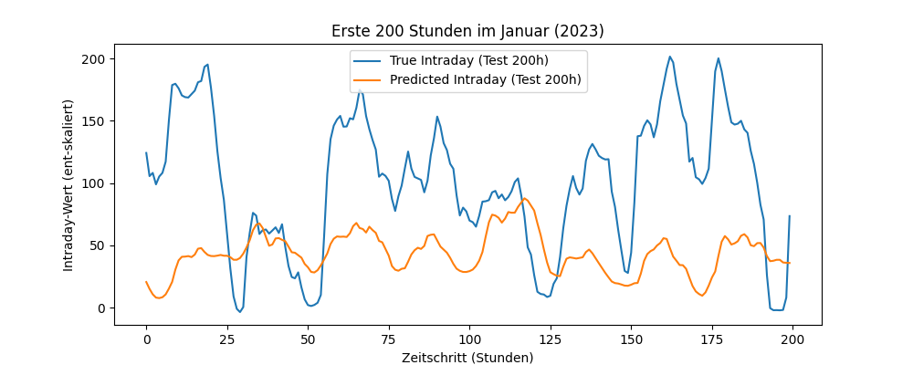

# <h1> 1 - Experiment
Interne Bezeichnung: `3. Testlauf`

#### <h2> Kurzbeschreibung 
Einer der ersten Versuche, eine LSTM mittels von ChatGPT vorgeschlagener Modellarchitektur bzw. Hyperparametern.  

#### <h2> Daten
`10Daten 2020 - 2023.xlsx`  
4 Jahre Daten  
Data Splitting:  
2020 + 2021 = Training  
2022 = Validierung  
2023 = Test
#### <h2> Features
- Day-Ahead
- Wochentag (1-7)
- Pumpenspeicher
- Handel
- Netzlast
- erneuerbare Energien
- nicht erneuerbare Energien
- Kernenergie 
- Wetterdaten (zu allen 30 Standorten)
  - Temperatur _(°C)_
  - Luftfeuchtigkeit _(%)_
  - Regen _(mm)_
  - Luftdruck _(hPa)_
  - Bewölkung _(%)_
  - Windgeschwindigkeit 10 m _(km/h)_
  - Windgeschwindigkeit 100 m _(km/h)_
  - Tag _(boolean)_
  - Kurzwellenstrahlung _(W/m²)_
  - Direkte Strahlung _(W/m²)_
  - Diffuser Strahlung _(W/m²)_
#### <h2> Ziele
- Vorhersage des Intraday Wert 
- Verbesserung der MSE und MAE
- Early-Stopping für bessere Leistung
#### <h2> Architektur
LSTM Modell verfügt über zwei gestapelte LSTM Layer:
- **Erster LSTM Layer:** _  Hidden Size 128   Dropout 0,3_
- **Zweiter LSTM Layer:** _  Hidden Size 64   Dropout 0,3_
- Hyperparameter 
- EPOCHS=50  
- LEARNING_RATE=0.0001 
- PATIENCE=5
- BATCH_SIZE=512

#### <h2> Leistungskriterien
- MSE (Mean Squared Error)    
- MAE (Mean Absolut Error)   
- Early Stopping
#### <h2> Baseline
#### <h2> Ergebnisse
| **Modell**    | MSE  (Mean Squared Error) | MAE   (Mean Absolut Error) |
|---------------|------------------------------|-------------------------------|
| LSTM          | 0,0115                       | 0,0921                        |

