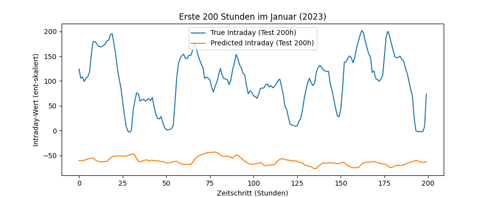

# <h1> 3 - Experiment
Interne Bezeichnung: `7. Testlauf`

#### <h2> Kurzbeschreibung 
Anpassung der Hyperparameter und Training **NUR mit Wetterdaten.** 

#### <h2> Daten

`11Daten 2020 - 2023.xlsx`  
4 Jahre Daten  
Data Splitting:  
2020 + 2021 = Training  
2022 = Validierung  
2023 = Test
#### <h2> Features 
- Wetterdaten (zu allen 30 Standorten)
  - Temperatur _(°C)_
  - Luftfeuchtigkeit _(%)_
  - Regen _(mm)_
  - Luftdruck _(hPa)_
  - Bewölkung _(%)_
  - Windgeschwindigkeit 10 m _(km/h)_
  - Windgeschwindigkeit 100 m _(km/h)_
  - Tag _(boolean)_
  - Kurzwellenstrahlung _(W/m²)_
  - Direkte Strahlung _(W/m²)_
  - Diffuser Strahlung _(W/m²)_
#### <h2> Ziele
- Veruch ohne Day-Ahead Preis und andere Auslastungsdaten zu Trainieren. 
- Verbesserung der MSE und MAE

#### <h2> Architektur
LSTM Modell verfügt nun nur noch über ein LSTM Modell:  
Hidden Size=128   Num Layers=2   Dropout=0,5 <- <- <- ANPASSUNG
- Hyperparameter 
- EPOCHS=50  
- LEARNING_RATE=0.0001 
- PATIENCE=5
- BATCH_SIZE=512

#### <h2> Leistungskriterien
- MSE (Mean Squared Error)    
- MAE (Mean Absolut Error)   
- Early Stopping
#### <h2> Baseline
#### <h2> Ergebnisse
| **Modell**    | MSE  (Mean Squared Error) | MAE   (Mean Absolut Error) |
|---------------|------------------------------|-------------------------------|
| LSTM          | 0,0610                       | 0,02354                       |

