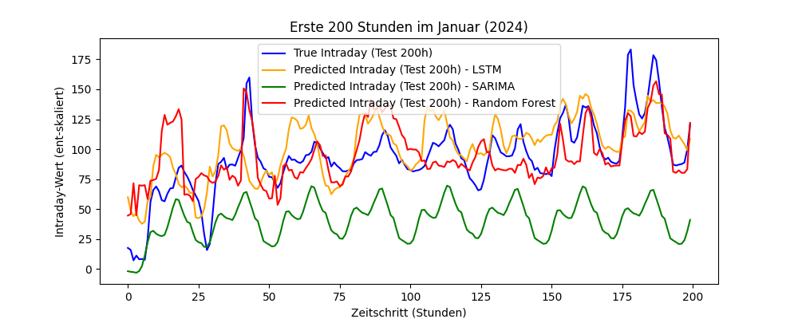

# <h1> 5 - Experiment
Interne Bezeichnung: `12. Testlauf`

#### <h2> Kurzbeschreibung 
Um die Performance vom LSTM zu bewerten wurden weitere Sequentielle Modelle  
wie das `SARIMA` oder ein Zufalls Decision Forest `Random Forest` implementiert,  
um die tatsächliche Leistung zu vergleichen.

#### <h2> Daten

`1Daten 2020 - 2024.xlsx`  
5 Jahre Daten  
Data Splitting:  
2020 + 2021 + 2022= Training  
2023 = Validierung  
2024 = Test
#### <h2> Features 
- Day-Ahead
- Wochentag (1-7)
- ist_Feiertag (boolean)
- wie_viel_Feiertag (%)
- Pumpenspeicher
- Handel
- Netzlast
- erneuerbare Energien
- nicht erneuerbare Energien
- Kernenergie 
- Wetterdaten (zu allen 30 Standorten)
  - Temperatur _(°C)_
  - Luftfeuchtigkeit _(%)_
  - Regen _(mm)_
  - Luftdruck _(hPa)_
  - Bewölkung _(%)_
  - Windgeschwindigkeit 10 m _(km/h)_
  - Windgeschwindigkeit 100 m _(km/h)_
  - is_turbine_spinning _(boolen)_
  - Tag _(boolean)_
  - Kurzwellenstrahlung _(W/m²)_
  - Direkte Strahlung _(W/m²)_
  - Diffuser Strahlung _(W/m²)_
#### <h2> Ziele
- Einführung von SARIMA und Random Forest
- Verbesserung der MSE und MAE

#### <h2> Architektur
Hidden Size=511   Num Layers=1   Dropout=0,55  
- Hyperparameter 
- EPOCHS=50  
- LEARNING_RATE=0.00830 
- PATIENCE=10
- BATCH_SIZE=256

#### <h2> Leistungskriterien
- MSE (Mean Squared Error)    
- MAE (Mean Absolut Error)   
- Early Stopping
#### <h2> Baseline
#### <h2> Ergebnisse
| **Modell**    | MSE  (Mean Squared Error) | MAE   (Mean Absolut Error) |
|---------------|------------------------------|-------------------------------|
| LSTM          | 0,0035                       | 0,0322                        |
| Random Forest | 0,0036                       | 0,0338                        |
| SARIMA        | 8441,3326                    | 66,9514                       |

