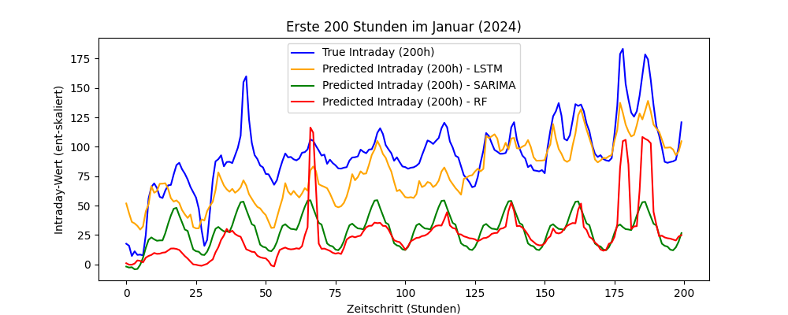

# <h1> 6 - Experiment
Interne Bezeichnung: `22. Testlauf`

#### <h2> Kurzbeschreibung 
Die Kalenderdaten wurden angepasst. Pro Wochentag eine Spalte mit boolean.  
Deutliche Anzahl an Features gedroppt. Für On und Off-Shore Parks nur noch die Windgeschwindigkeit und ob die Turbin läuft oder nicht.  
Für Solarparks nur noch die Strahlungswerte. 

#### <h2> Daten

`5Daten 2020 - 2024.xlsx`  
5 Jahre Daten  
Data Splitting:  
2020 + 2021 + 2022= Training  
2023 = Validierung  
2024 = Test
#### <h2> Features 
- Day-Ahead
- Wochentag (boolean) Pro Wochentag eine Spalte
- ist_Feiertag (boolean)
- wie_viel_Feiertag (%)
- Netzlast
- erneuerbare Energien
- nicht erneuerbare Energien
- Kernenergie 
- Wetterdaten zu WIND
  - Windgeschwindigkeit 100 m _(km/h)_
  - is_turbine_spinning _(boolen)_
- Wetterdaten zu SOLAR
  - Kurzwellenstrahlung _(W/m²)_
  - Direkte Strahlung _(W/m²)_
  - Diffuser Strahlung _(W/m²)_
#### <h2> Ziele
- Verbesserung der Werte durch weniger Feature Rauschen 

#### <h2> Architektur
Hidden Size=511   Num Layers=1   Dropout=0,55  
- Hyperparameter 
- EPOCHS=50  
- LEARNING_RATE=0.00830 
- PATIENCE=10
- BATCH_SIZE=256

#### <h2> Leistungskriterien
- MSE (Mean Squared Error)    
- MAE (Mean Absolut Error)   
- Early Stopping
#### <h2> Baseline
#### <h2> Ergebnisse
| **Modell**    | MSE  (Mean Squared Error) | MAE   (Mean Absolut Error) |
|---------------|------------------------------|-------------------------------|
| LSTM          | 0,0032                       | 0,0384                        |
| Random Forest | 0,0055                       | 0,0558                        |
| SARIMA        | 9317,7334                    | 72,9677                       |

